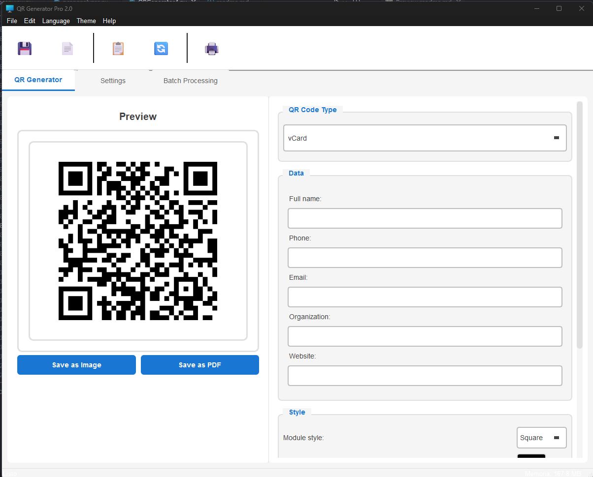

# QR Generator Pro 2.0

<div align="center">
  
  
  
  
</div>


English Version

## History 

I always want to make my own QR generator

## 📋 Description

QR Generator Pro is a professional desktop application for generating QR codes with advanced features. Developed with Python and PySide6, it offers a modern and user-friendly interface with support for multiple QR code types, style customization, and batch processing.

**Developed by LGP with much help from [Claude/Anthropic LLM](https://www.anthropic.com/claude)**

## ✨ Features

- 🎨 **Modern Interface**: Clean design with light/dark theme
- 🌐 **Multi-language**: Support for Spanish and English
- 📱 **Multiple QR Types**:
  - Simple text
  - URLs
  - Email (with subject and message)
  - Phone numbers
  - WiFi networks
  - SMS
  - Contact cards (vCard)
- 🎯 **Advanced Customization**:
  - 5 module styles (Square, Rounded, Circle, Gapped, Vertical bars)
  - Customizable colors
  - Gradients
  - Adjustable module size and border
  - 4 error correction levels
- 💾 **Export Options**:
  - Save as image (PNG, JPG, BMP, GIF)
  - Export to PDF with custom title
  - Copy to clipboard
  - Direct printing
- ⚡ **Batch Processing**: Generate multiple QRs from CSV files
- 🔄 **Auto Save**: Option to automatically save generated QRs

## 📸 Screenshots

<div align="center">
  <i>Main application interface with light theme</i>
</div>

<p align="center">
  
  <br>
  <i>Main application interface with light theme</i>
  <em>QR code generator PRO</em>
</p>


## 🚀 Installation

### Prerequisites

- Python 3.8 or higher
- pip (Python package manager)

### Dependencies

```bash
pip install PySide6 pillow qrcode reportlab psutil
```

### Windows Installation

```bash
# Clone the repository
git clone https://github.com/your-username/qr-generator-pro.git
cd qr-generator-pro

# Install dependencies
pip install -r requirements.txt

# Run the application
python QRGenerator.py
```

### Linux Installation

```bash
# Install system dependencies (Ubuntu/Debian)
sudo apt-get install python3-pip python3-dev

# Clone the repository
git clone https://github.com/your-username/qr-generator-pro.git
cd qr-generator-pro

# Install dependencies
pip3 install -r requirements.txt

# Run the application
python3 QRGenerator.py
```

### macOS Installation

```bash
# Clone the repository
git clone https://github.com/your-username/qr-generator-pro.git
cd qr-generator-pro

# Install dependencies
pip3 install -r requirements.txt

# Run the application
python3 QRGenerator.py
```

## 📝 Usage

### Generate a Simple QR

1. Select the QR code type from the dropdown menu
2. Enter the required data
3. Customize style and colors if desired
4. Click "Save as Image" or "Save as PDF"

### Batch Processing

1. Go to the "Batch Processing" tab
2. Prepare a CSV file with columns: `type`, `data`, `pdf_title`
3. Select the CSV file and output folder
4. Click "Process Batch"

#### CSV File Example:
```csv
type,data,pdf_title
URL,https://github.com,GitHub
Phone,+1234567890,Contact
Text,Hello World,Greeting
```

### Keyboard Shortcuts

- `Ctrl+S` - Save as PDF
- `Ctrl+I` - Save as image
- `Ctrl+R` - Clear all
- `Ctrl+P` - Print
- `F1` - Show help

## 🔧 Configuration

The application automatically saves your preferences:
- Error correction level
- Module size and border
- Preferred module style
- Selected language
- Theme (light/dark)

## 📁 Project Structure

```
qr-generator-pro/
│
├── QRGenerator.py          # Main application file
├── requirements.txt        # Python dependencies
├── README.md              # This file
├── LICENSE                # MIT License
└── examples/              # Usage examples
    └── batch_example.csv  # CSV file example for batch processing
```

## 🤝 Contributing

Contributions are welcome! Please:

1. Fork the project
2. Create your feature branch (`git checkout -b feature/AmazingFeature`)
3. Commit your changes (`git commit -m 'Add some AmazingFeature'`)
4. Push to the branch (`git push origin feature/AmazingFeature`)
5. Open a Pull Request

## 🐛 Bug Reports

If you find a bug, please open an [issue](https://github.com/your-username/qr-generator-pro/issues) with:
- Bug description
- Steps to reproduce
- Operating system and Python version
- Screenshots if relevant

## 📄 License

This project is licensed under the MIT License - see the [LICENSE](LICENSE) file for details.

## 👏 Acknowledgments

- **[Claude/Anthropic](https://www.anthropic.com/claude)** - For invaluable help in development
- **PySide6 Community** - For excellent documentation
- **qrcode library** - For QR code generation
- **ReportLab** - For PDF generation capabilities

## 📞 Contact

LGP - [@leonelpedroza](https://x.com/leonelpedroza)

Project Link: [https://github.com/leonelpedroza/QRCodeGeneratorPRO](https://github.com/leonelpedroza/QRCodeGeneratorPRO)


---

<div align="center">
  Made with 🧠 by LGP and <a href="https://www.anthropic.com/claude">Claude Anthropic LLM</a>
</div>

________________________________________


# QR Generator Pro 2.0

<div align="center">
  
  
  
  
</div>

Versión en español.

## Historia  

Siempre quise hacer mi propio generador de códigos QR


## 📋 Descripción

QR Generator Pro es una aplicación profesional de escritorio para generar códigos QR con características avanzadas. Desarrollada con Python y PySide6, ofrece una interfaz moderna y fácil de usar con soporte para múltiples tipos de códigos QR, personalización de estilos y procesamiento por lotes.

**Desarrollado por LGP con mucha ayuda de Claude/Anthropic LLM**

## ✨ Características

- 🎨 **Interfaz Moderna**: Diseño limpio con tema claro/oscuro
- 🌐 **Multi-idioma**: Soporte para Español e Inglés
- 📱 **Múltiples Tipos de QR**:
  - Texto simple
  - URLs
  - Email (con asunto y mensaje)
  - Números de teléfono
  - Redes WiFi
  - SMS
  - Tarjetas de contacto (vCard)
- 🎯 **Personalización Avanzada**:
  - 5 estilos de módulos (Cuadrado, Redondeado, Circular, Con espacios, Barras verticales)
  - Colores personalizables
  - Degradados
  - Tamaño de módulo y borde ajustables
  - 4 niveles de corrección de errores
- 💾 **Opciones de Exportación**:
  - Guardar como imagen (PNG, JPG, BMP, GIF)
  - Exportar a PDF con título personalizado
  - Copiar al portapapeles
  - Imprimir directamente
- ⚡ **Procesamiento por Lotes**: Genera múltiples QR desde archivos CSV
- 🔄 **Guardado Automático**: Opción de guardar automáticamente los QR generados

## 📸 Capturas de Pantalla


<p align="center">
  
  <br>
  <i>Interfaz principal de la aplicación con tema claro</i>
  <em>QR code generator PRO</em>
</p>


## 🚀 Instalación

### Requisitos Previos

- Python 3.8 o superior
- pip (gestor de paquetes de Python)

### Dependencias

```bash
pip install PySide6 pillow qrcode reportlab psutil
```

### Instalación en Windows

```bash
# Clonar el repositorio
git clone https://github.com/tu-usuario/qr-generator-pro.git
cd qr-generator-pro

# Instalar dependencias
pip install -r requirements.txt

# Ejecutar la aplicación
python QRGenerator.py
```

### Instalación en Linux

```bash
# Instalar dependencias del sistema (Ubuntu/Debian)
sudo apt-get install python3-pip python3-dev

# Clonar el repositorio
git clone https://github.com/tu-usuario/qr-generator-pro.git
cd qr-generator-pro

# Instalar dependencias
pip3 install -r requirements.txt

# Ejecutar la aplicación
python3 QRGenerator.py
```

### Instalación en macOS

```bash
# Clonar el repositorio
git clone https://github.com/tu-usuario/qr-generator-pro.git
cd qr-generator-pro

# Instalar dependencias
pip3 install -r requirements.txt

# Ejecutar la aplicación
python3 QRGenerator.py
```

## 📝 Uso

### Generar un QR Simple

1. Selecciona el tipo de código QR del menú desplegable
2. Ingresa los datos requeridos
3. Personaliza el estilo y colores si lo deseas
4. Haz clic en "Guardar como Imagen" o "Guardar como PDF"

### Procesamiento por Lotes

1. Ve a la pestaña "Procesamiento por Lotes"
2. Prepara un archivo CSV con las columnas: `type`, `data`, `pdf_title`
3. Selecciona el archivo CSV y la carpeta de salida
4. Haz clic en "Procesar Lote"

#### Ejemplo de archivo CSV:
```csv
type,data,pdf_title
URL,https://github.com,GitHub
Phone,+1234567890,Contacto
Text,Hola Mundo,Saludo
```

### Atajos de Teclado

- `Ctrl+S` - Guardar como PDF
- `Ctrl+I` - Guardar como imagen
- `Ctrl+R` - Limpiar todo
- `Ctrl+P` - Imprimir
- `F1` - Mostrar ayuda

## 🔧 Configuración

La aplicación guarda automáticamente tus preferencias:
- Nivel de corrección de errores
- Tamaño de módulo y borde
- Estilo de módulo preferido
- Idioma seleccionado
- Tema (claro/oscuro)

## 📁 Estructura del Proyecto

```
qr-generator-pro/
│
├── QRGenerator.py          # Archivo principal de la aplicación
├── requirements.txt        # Dependencias de Python
├── README.md              # Este archivo
├── LICENSE                # Licencia MIT
└── examples/              # Ejemplos de uso
    └── batch_example.csv  # Ejemplo de archivo CSV para procesamiento por lotes
```

## 🤝 Contribuciones

Las contribuciones son bienvenidas. Por favor:

1. Haz un Fork del proyecto
2. Crea una rama para tu característica (`git checkout -b feature/AmazingFeature`)
3. Haz commit de tus cambios (`git commit -m 'Add some AmazingFeature'`)
4. Push a la rama (`git push origin feature/AmazingFeature`)
5. Abre un Pull Request

## 🐛 Reporte de Errores

Si encuentras un error, por favor abre un [issue](https://github.com/tu-usuario/qr-generator-pro/issues) con:
- Descripción del error
- Pasos para reproducirlo
- Sistema operativo y versión de Python
- Capturas de pantalla si es relevante

## 📄 Licencia

Este proyecto está licenciado bajo la Licencia MIT - ver el archivo [LICENSE](LICENSE) para más detalles.

## 👏 Agradecimientos

- **Claude/Anthropic** - Por la invaluable ayuda en el desarrollo
- **Comunidad PySide6** - Por la excelente documentación
- **qrcode library** - Por la generación de códigos QR
- **ReportLab** - Por las capacidades de generación de PDF

## 📞 Contacto

LGP - [@leonelpedroza](https://x.com/leonelpedroza)

Link del Proyecto: [https://github.com/leonelpedroza/QRCodeGeneratorPRO](https://github.com/leonelpedroza/QRCodeGeneratorPRO)

---


<div align="center">
  Hecho con 🧠 por LGP y <a href="https://www.anthropic.com/claude">Claude Anthropic LLM</a>
</div>
